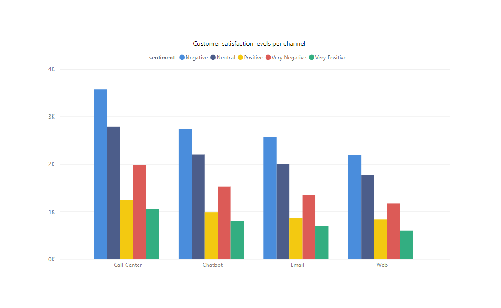

# Call Center Analysis

## Introduction
This is a project on the call centre analysis of an imaginary eCommerce company called "Urbn Luxe." The project is to analyze and derive insights to answer questions that will help the store improve customer satisfaction.

**_Disclaimer_**: _All datasets and reports do not represent any company, institution or country_. 

## Data Source
Call Center Data: The primary dataset used for this analysis is the ([Call Center.csv](https://github.com/Crowei-Gibson/Call-center-analysis#:~:text=2%20Commits-,Call%20Center.csv,-uploading%20files)), containing information about the company's call centre for October.

## Tools Used
- Excel
- PowerBI

## Data Cleaning/Preparation
In the initial phase, I performed the following tasks:
1. Data loading and inspection
2. Handling Missing Values
3. Corrected incorrectly formatted columns

## Exploratory Data Analysis(Problem Statement)
- What is the overall level of customer satisfaction?
- What is the most common reason for call centre interactions?
- Which channels have the best response time?
- Which call centre processed the most calls
- What is the performance of each channel?

### Overall level of customer satisfaction

### Reason for call centre interactions
